# 🌞 Metodologia Solar - Manifesto Solanis.ai

<div align="center">
  
  
  <br/><br/>
  
  
  
  
  
</div>

<div align="center">

## ✨ *"Iluminando soluções através de processos inteligentes"* ✨

**A Metodologia Solar é o framework revolucionário da Solanis.ai para desenvolvimento de soluções de IA que realmente transformam negócios.**

</div>

---

## 🌟 **Stack Tecnológico de Elite**

<div align="center">

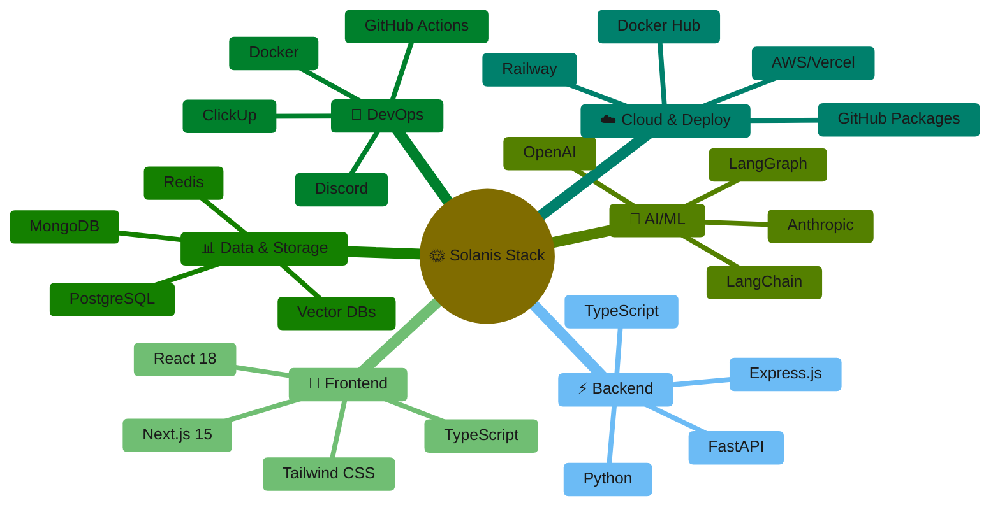

</div>

---

## 🎯 **Visão Geral da Metodologia**

<div align="center">

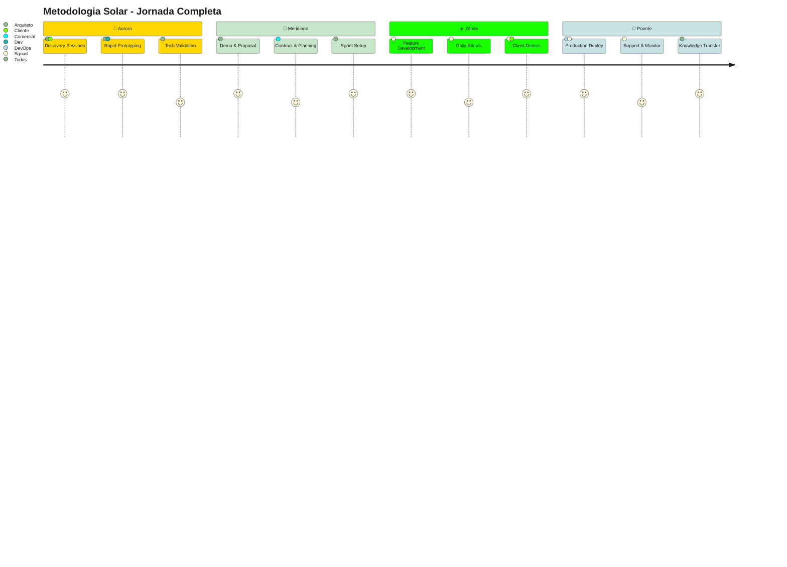

</div>

---

## 🏗️ **Estrutura Organizacional Elite**

<div style="background: linear-gradient(135deg, #FFD700 0%, #FFA000 100%); padding: 20px; border-radius: 10px; margin: 20px 0;">

### **🏛️ Arquiteto de Soluções IA**
> *O maestro da orquestra tecnológica*

- 🎨 **Criar arquiteturas** escaláveis com LangChain/LangGraph
- 🔍 **Liderar discovery** técnico e prototipagem rápida
- 📐 **Definir padrões** de desenvolvimento e AI workflows
- 🎯 **Revisar propostas** técnicas e estimativas de esforço

### **👥 Squad de Desenvolvimento Full-Stack**
> *Os artesãos do código*

- ⚡ **Implementar soluções** seguindo arquitetura definida
- 🔄 **Executar code reviews** e pair programming
- 📚 **Manter documentação** atualizada no GitHub
- 🧪 **Realizar testes** automatizados e validações

</div>

---

## 🌅 **Fase 1: Aurora** *(Discovery & Prototipagem)*
### ⏱️ *Duração: 3-5 dias úteis*

<div align="center">

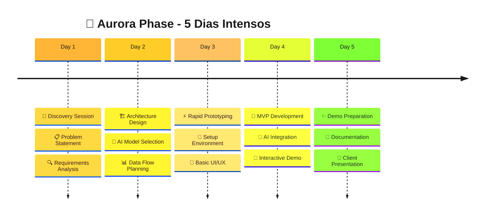

</div>

### **1.1 🎯 Sessão de Discovery Intensiva**

<div align="center">

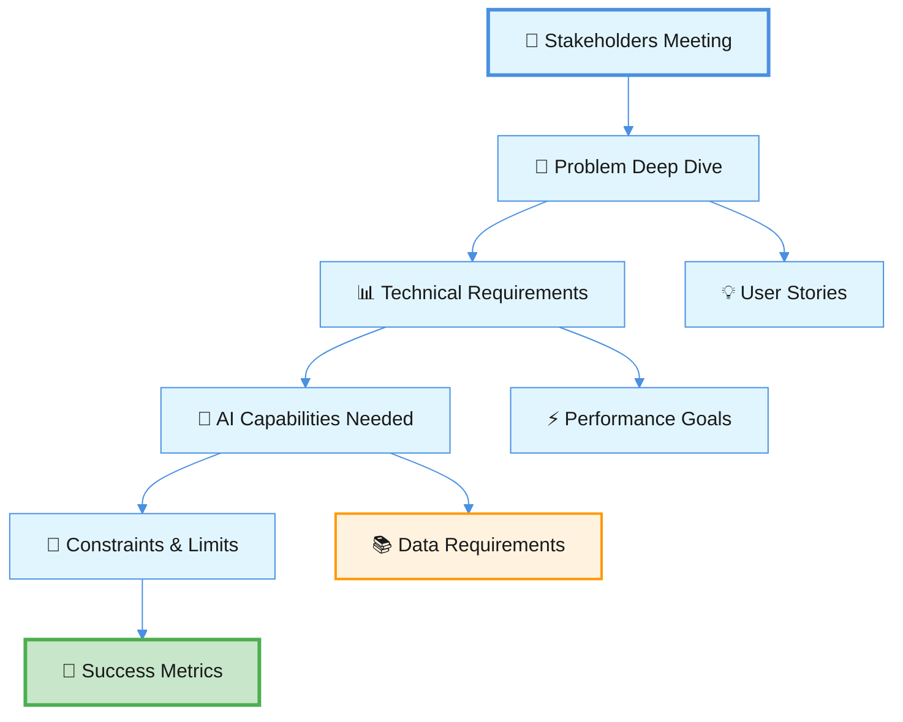

</div>

**🎪 Participantes**: Arquiteto + Dev Lead + Stakeholders  
**⏰ Duração**: 3-4 horas intensivas  
**🎁 Entregáveis**:
- 📋 Problem Statement cristalino
- 🔧 Requisitos funcionais/não-funcionais
- 🚧 Restrições técnicas e de negócio
- 🏆 Critérios de sucesso mensuráveis

### **1.2 🔬 Análise Técnica Profunda**

<div align="center">

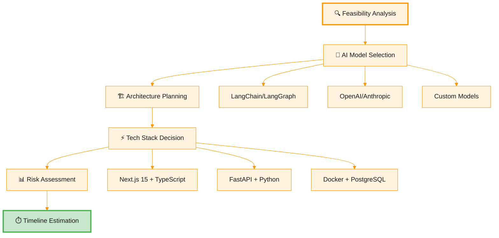

</div>

### **1.3 ⚡ Prototipagem Lightning Fast**

<div align="center">

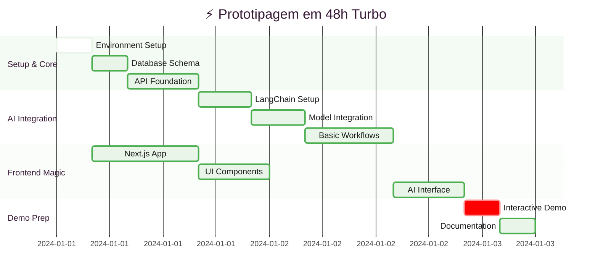

</div>

**🎁 Entregáveis Épicos**:
- 🚀 MVP funcional (proof of concept)
- 🏗️ Diagramas de arquitetura em Mermaid
- 🔄 Fluxogramas de processo IA
- 🎮 Demo interativo impressionante

---

## 🌇 **Fase 2: Meridiano** *(Proposta & Planejamento)*
### ⏱️ *Duração: 2-3 dias úteis*

<div style="background: linear-gradient(135deg, #E1BEE7 0%, #9C27B0 100%); padding: 20px; border-radius: 10px; margin: 20px 0; color: white;">

### **2.1 🎪 Apresentação Épica do Protótipo**

<div align="center">

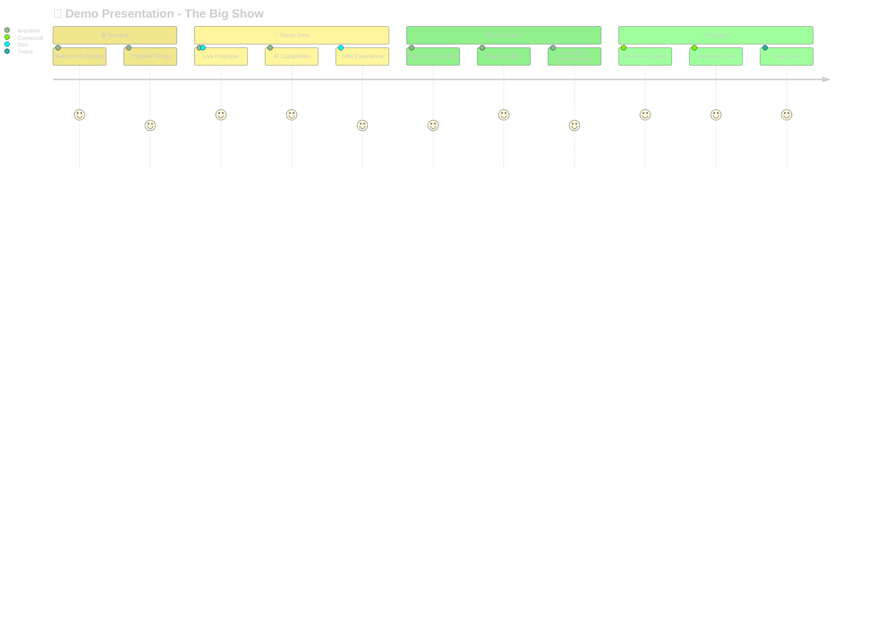

</div>

### **2.2 📋 Proposta Irresistível**

- 📊 **Scope Detalhado** com epics e user stories
- 📅 **Cronograma de Sprints** com milestones claros
- 💰 **Modelo de Investimento** transparente e justo
- 📋 **Termos & Condições** objetivos e flexíveis
- 🎯 **Métricas de Sucesso** mensuráveis e alcançáveis

</div>

---

## ☀️ **Fase 3: Zênite** *(Desenvolvimento)*
### ⏱️ *Duração: Variável por projeto*

### **🔥 Estrutura de Sprint Otimizada**

<div align="center">

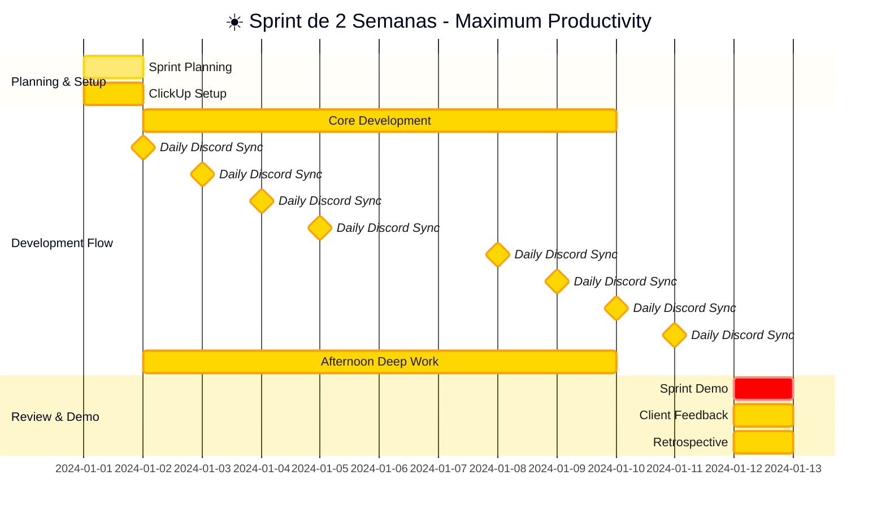

</div>

### **🎯 Entregas por Milestone**

<div align="center">

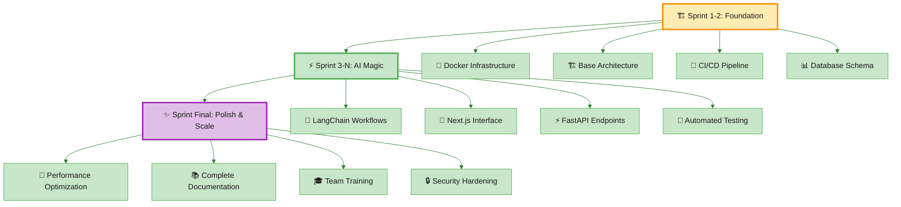

</div>

---

## 🌅 **Fase 4: Poente** *(Entrega & Suporte)*
### ⏱️ *Duração: 3-4 semanas*

<div align="center">

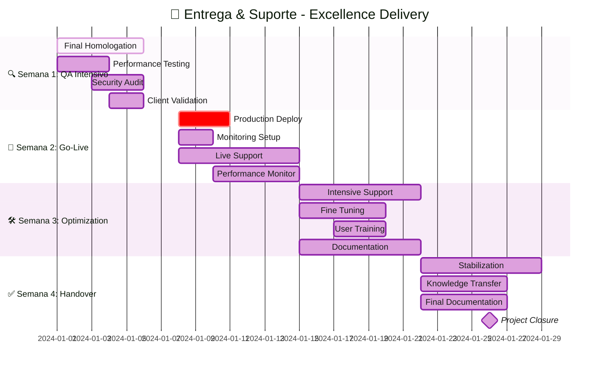

</div>

---

## ⚡ **Rituais Diários de Alta Performance**

<div style="display: flex; gap: 20px; justify-content: space-between; margin: 20px 0;">

<div style="background: linear-gradient(135deg, #E3F2FD 0%, #2196F3 100%); padding: 15px; border-radius: 10px; flex: 1;">

### **🌅 Discord Daily Sync (9h00)**

<div align="center">

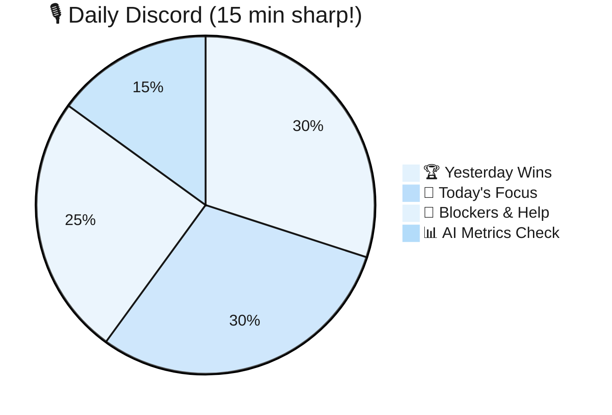

</div>

</div>

<div style="background: linear-gradient(135deg, #FFF3E0 0%, #FF9800 100%); padding: 15px; border-radius: 10px; flex: 1;">

### **🎯 Deep Work Session (14h00)**

- 🧠 **Complex Problem Solving** (45 min)
- ☕ **Quick Break** (15 min)
- 👥 **Pair Programming** (45 min)
- 📝 **Documentation & Review** (15 min)

</div>

</div>

---

## 🛠️ **Padrões de Arquitetura Solanis**

### **🎨 Template de Arquitetura IA Next-Gen**

<div align="center">

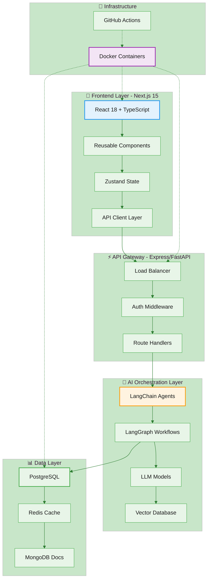

</div>

---

## 🚀 **CI/CD & GitHub Integration de Elite**

### **🎯 Pipeline Completo de Deploy**

<div align="center">

```mermaid
%%{init: {'theme':'base', 'themeVariables': {'primaryColor':'#E1BEE7','primaryTextColor':'#1a1a1a','primaryBorderColor':'#9C27B0','lineColor':'#7B1FA2','secondaryColor':'#CE93D8','tertiaryColor':'#F3E5F5'}}}%%
graph LR
    A[💻 Code Push] --> B[🔍 GitHub Actions]
    B --> C[🧪 Automated Tests]
    C --> D[🏗️ Docker Build]
    D --> E[📦 Package & Push]
    E --> F[🚀 Deploy Staging]
    F --> G[✅ E2E Tests]
    G --> H[👤 Manual Review]
    H --> I[🌐 Production Deploy]
    I --> J[📊 Monitoring Active]
    
    C -.->|❌ Test Fail| K[🚫 Pipeline Stop]
    G -.->|❌ E2E Fail| K
    J -.->|⚠️ Issues| L[🔔 Discord Alert]
    
    style A fill:#E3F2FD,stroke:#2196F3,stroke-width:3px
    style I fill:#C8E6C9,stroke:#4CAF50,stroke-width:3px
    style K fill:#FFEBEE,stroke:#F44336,stroke-width:3px
    style L fill:#FFF3E0,stroke:#FF9800,stroke-width:3px
```

</div>

---

## 📊 **Dashboard de Métricas Elite**

### **🎯 Métricas de Performance em Tempo Real**

<div align="center">

```mermaid
%%{init: {'theme':'base', 'themeVariables': {'primaryColor':'#E8F5E8','primaryTextColor':'#1a1a1a','primaryBorderColor':'#4CAF50','lineColor':'#2E7D32','secondaryColor':'#A5D6A7','tertiaryColor':'#C8E6C9'}}}%%
graph TD
    DASH[📊 Solanis Command Center] --> PROJECT[📈 Project Metrics]
    DASH --> AI[🤖 AI Performance]
    DASH --> TECH[⚙️ Technical Health]
    DASH --> BUSINESS[💼 Business KPIs]
    
    PROJECT --> P1[🚀 Sprint Velocity]
    PROJECT --> P2[⏱️ Lead Time]
    PROJECT --> P3[📅 Deployment Frequency]
    PROJECT --> P4[🎯 Story Points Completed]
    
    AI --> A1[🎯 Model Accuracy]
    AI --> A2[⚡ Inference Speed]
    AI --> A3[📊 Token Usage]
    AI --> A4[🔄 LangChain Success Rate]
    
    TECH --> T1[🧪 Test Coverage]
    TECH --> T2[🐛 Bug Resolution Time]
    TECH --> T3[🚀 API Response Time]
    TECH --> T4[🐳 Container Health]
    
    BUSINESS --> B1[😊 Client Satisfaction]
    BUSINESS --> B2[💰 Project ROI]
    BUSINESS --> B3[⏰ Time to Value]
    BUSINESS --> B4[🔄 Feature Adoption]
    
    style DASH fill:#E1BEE7,stroke:#9C27B0,stroke-width:4px
    style PROJECT fill:#C8E6C9,stroke:#4CAF50,stroke-width:3px
    style AI fill:#FFE4B5,stroke:#FF9800,stroke-width:3px
    style TECH fill:#E3F2FD,stroke:#2196F3,stroke-width:3px
    style BUSINESS fill:#FFF3E0,stroke:#FF9800,stroke-width:3px
```

</div>

---

## 🏆 **Definition of Done - Padrão Ouro**

### **✨ Feature Definition of Done**

<div align="center">

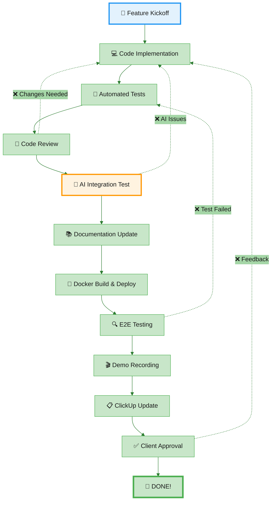

</div>

### **🎯 Sprint Definition of Done Checklist**

<div style="background: linear-gradient(135deg, #C8E6C9 0%, #4CAF50 100%); padding: 20px; border-radius: 10px; margin: 20px 0; color: white;">

**📋 Checklist Obrigatório:**
- ✅ **Todas as features planejadas** entregues e funcionais
- ✅ **Cobertura de testes** >= 80% para código novo
- ✅ **AI models** validados com métricas de accuracy
- ✅ **Performance benchmarks** atingidos (< 2s response time)
- ✅ **Demo gravada** e compartilhada no Discord
- ✅ **ClickUp atualizado** com progresso real
- ✅ **Docker images** builded e pushed para registry
- ✅ **Documentação técnica** atualizada no GitHub
- ✅ **Client feedback** coletado e incorporado
- ✅ **Retrospectiva** realizada com action items

</div>

---

## 🎨 **Guia de Estilo Visual Solanis**

### **🌈 Paleta de Cores Oficial**

```css
/* 🌞 Paleta Solar Solanis */
:root {
  /* Primary - Dourado Solar */
  --solanis-gold: #FFD700;
  --solanis-gold-light: #FFECB3;
  --solanis-gold-dark: #FFA000;
  
  /* Secondary - Roxo Místico */
  --solanis-purple: #E1BEE7;
  --solanis-purple-light: #F3E5F5;
  --solanis-purple-dark: #9C27B0;
  
  /* Accent - Verde Energia */
  --solanis-green: #C8E6C9;
  --solanis-green-light: #E8F5E8;
  --solanis-green-dark: #4CAF50;
  
  /* Info - Azul Céu */
  --solanis-blue: #E3F2FD;
  --solanis-blue-light: #F3F9FF;
  --solanis-blue-dark: #2196F3;
  
  /* Warning - Laranja Energia */
  --solanis-orange: #FFF3E0;
  --solanis-orange-light: #FFF8F0;
  --solanis-orange-dark: #FF9800;
  
  /* Gradients */
  --gradient-solar: linear-gradient(135deg, #FFD700 0%, #FFA000 100%);
  --gradient-mystical: linear-gradient(135deg, #E1BEE7 0%, #9C27B0 100%);
  --gradient-energy: linear-gradient(135deg, #C8E6C9 0%, #4CAF50 100%);
  --gradient-sky: linear-gradient(135deg, #E3F2FD 0%, #2196F3 100%);
  --gradient-warm: linear-gradient(135deg, #FFF3E0 0%, #FF9800 100%);
}
```

### **🎯 Componentes de Interface**

<div style="display: grid; grid-template-columns: repeat(auto-fit, minmax(250px, 1fr)); gap: 15px; margin: 20px 0;">

<div style="background: var(--gradient-solar); padding: 15px; border-radius: 10px; color: #1a1a1a;">
<strong>🌞 Solar Button</strong><br/>
Primary actions & CTAs
</div>

<div style="background: var(--gradient-mystical); padding: 15px; border-radius: 10px; color: white;">
<strong>🔮 Mystical Card</strong><br/>
AI features & magic
</div>

<div style="background: var(--gradient-energy); padding: 15px; border-radius: 10px; color: #1a1a1a;">
<strong>⚡ Energy Badge</strong><br/>
Success states & metrics
</div>

<div style="background: var(--gradient-sky); padding: 15px; border-radius: 10px; color: #1a1a1a;">
<strong>☁️ Sky Panel</strong><br/>
Information & data
</div>

</div>

---

## 🎖️ **DORA Metrics - Elite Performance**

<div align="center">

```mermaid
%%{init: {'theme':'base', 'themeVariables': {'primaryColor':'#FFD700','primaryTextColor':'#1a1a1a','primaryBorderColor':'#FFA000','lineColor':'#FF6F00','secondaryColor':'#E1BEE7','tertiaryColor':'#C8E6C9'}}}%%
graph TD
    DORA[🎖️ DORA Metrics Dashboard] --> DF[🚀 Deployment Frequency]
    DORA --> LT[⏱️ Lead Time for Changes]
    DORA --> CFR[🎯 Change Failure Rate]
    DORA --> RT[🔧 Recovery Time]
    
    DF --> DF1[Target: Daily Deploys]
    DF --> DF2[Current: 2-3x per week]
    DF --> DF3[Status: High Performer]
    
    LT --> LT1[Target: < 1 day]
    LT --> LT2[Current: 2-3 days]
    LT --> LT3[Status: High Performer]
    
    CFR --> CFR1[Target: < 15%]
    CFR --> CFR2[Current: 8-10%]
    CFR --> CFR3[Status: Elite Performer]
    
    RT --> RT1[Target: < 1 hour]
    RT --> RT2[Current: 30 min avg]
    RT --> RT3[Status: Elite Performer]
    
    style DORA fill:#FFD700,stroke:#FFA000,stroke-width:4px
    style DF3 fill:#C8E6C9,stroke:#4CAF50,stroke-width:3px
    style LT3 fill:#C8E6C9,stroke:#4CAF50,stroke-width:3px
    style CFR3 fill:#E8F5E8,stroke:#4CAF50,stroke-width:3px
    style RT3 fill:#E8F5E8,stroke:#4CAF50,stroke-width:3px
```

</div>

---

## 📈 **ClickUp Integration Dashboard**

<div align="center">

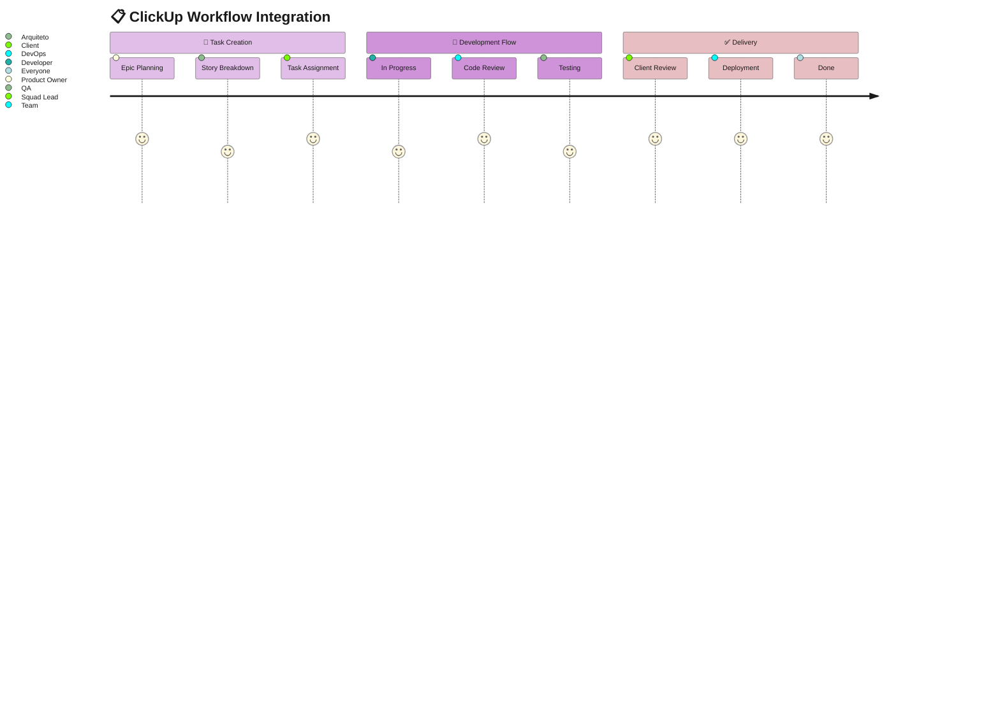

</div>

## 🎉 **Conclusão da Metodologia Solar**

<div style="background: linear-gradient(135deg, #FFD700 0%, #FFA000 50%, #E1BEE7 100%); padding: 30px; border-radius: 15px; margin: 30px 0; color: #1a1a1a; text-align: center;">

### **🌟 A Metodologia Solar v2.0 representa nossa evolução para um framework de desenvolvimento de IA verdadeiramente ELITE**

</div>

### **🚀 Diferenciais Únicos:**

<div style="display: grid; grid-template-columns: repeat(auto-fit, minmax(300px, 1fr)); gap: 20px; margin: 30px 0;">

<div style="background: linear-gradient(135deg, #E3F2FD 0%, #2196F3 100%); padding: 20px; border-radius: 10px; color: white;">
<h4>⚡ Prototipagem Lightning</h4>
<p>48h para MVP funcional com IA integrada e demo interativo</p>
</div>

<div style="background: linear-gradient(135deg, #E8F5E8 0%, #4CAF50 100%); padding: 20px; border-radius: 10px; color: white;">
<h4>🎯 Stack Moderno</h4>
<p>Next.js 15, FastAPI, LangChain, Docker em arquitetura escalável</p>
</div>

<div style="background: linear-gradient(135deg, #F3E5F5 0%, #9C27B0 100%); padding: 20px; border-radius: 10px; color: white;">
<h4>🔄 Integração Total</h4>
<p>GitHub + ClickUp + Discord em workflows automatizados</p>
</div>

<div style="background: linear-gradient(135deg, #FFF3E0 0%, #FF9800 100%); padding: 20px; border-radius: 10px; color: white;">
<h4>📊 Métricas Elite</h4>
<p>DORA metrics + AI performance tracking em tempo real</p>
</div>

</div>

### **📈 Resultados Esperados:**

<div align="center">

| 🎯 **Métrica** | 📊 **Target** | 🏆 **Status** |
|:---|:---:|:---:|
| **Velocidade de Prototipagem** | +300% | 🚀 Elite |
| **Accuracy em Estimativas** | 95%+ | ⚡ High |
| **API Response Time** | <2s | ✅ Elite |
| **Net Promoter Score** | 9+ | 😊 Elite |
| **DORA Performance** | Elite | 🏆 Elite |

</div>
