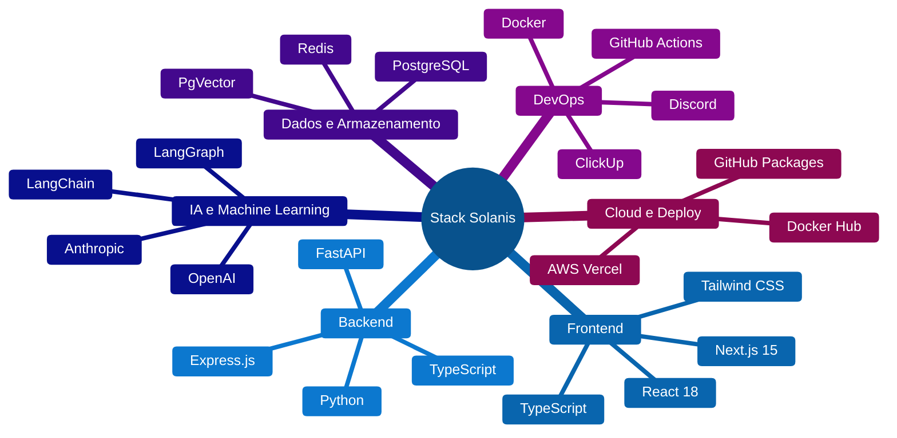
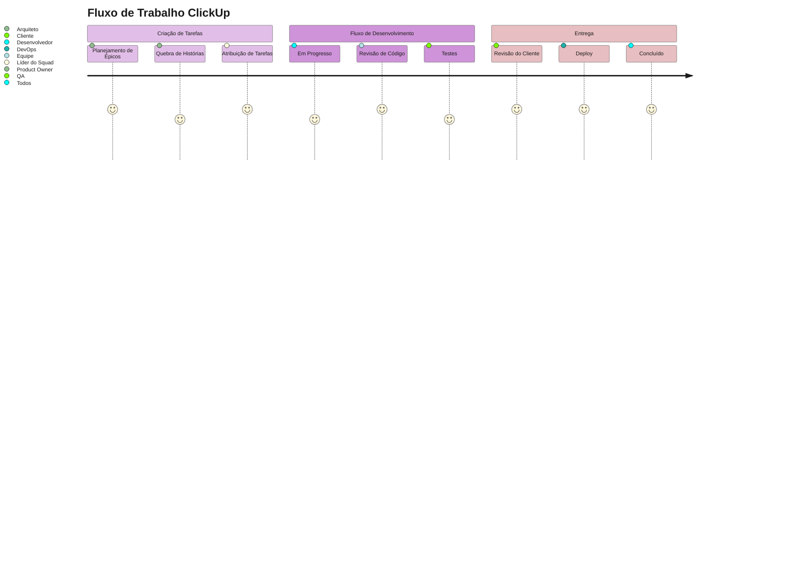

# Metodologia Solar - Framework de Desenvolvimento IA

  
  
    
  
  
  
  
  

## "Framework estruturado para desenvolvimento de soluções empresariais com Inteligência Artificial"

**Metodologia consolidada para entrega de projetos de IA que geram valor real para o negócio.**

---

## Stack Tecnológico

---

## Visão Geral da Metodologia

---

## Estrutura Organizacional

### Arquiteto de Soluções IA
*Responsável pela visão técnica e arquitetural*

- Criar arquiteturas escaláveis utilizando LangChain e LangGraph
- Liderar descoberta técnica e prototipagem rápida
- Definir padrões de desenvolvimento e workflows de IA
- Revisar propostas técnicas e estimativas de esforço

### Squad de Desenvolvimento Full-Stack
*Equipe responsável pela implementação*

- Implementar soluções seguindo arquitetura definida
- Executar revisões de código e programação em pares
- Manter documentação atualizada no GitHub
- Realizar testes automatizados e validações

---

## Fase 1: Descoberta e Prototipagem
### Duração: 3-5 dias úteis

### 1.1 Sessão de Discovery Intensiva

**Participantes**: Arquiteto + Líder de Desenvolvimento + Stakeholders  
**Duração**: 3-4 horas  
**Entregáveis**:
- Definição clara do problema
- Requisitos funcionais e não-funcionais
- Restrições técnicas e de negócio
- Critérios de sucesso mensuráveis

### 1.2 Análise Técnica

### 1.3 Prototipagem Rápida

**Entregáveis**:
- MVP funcional (prova de conceito)
- Diagramas de arquitetura
- Fluxogramas de processo de IA
- Demonstração interativa

---

## Fase 2: Planejamento e Proposta
### Duração: 2-3 dias úteis

### 2.1 Apresentação do Protótipo

### 2.2 Proposta Comercial

- **Escopo Detalhado** com épicos e histórias de usuário
- **Cronograma de Sprints** com marcos claros
- **Modelo de Investimento** transparente
- **Termos e Condições** objetivos
- **Métricas de Sucesso** mensuráveis

---

## Fase 3: Desenvolvimento
### Duração: Variável por projeto

### Estrutura de Sprint

### Entregas por Marco

---

## Fase 4: Entrega e Suporte
### Duração: 3-4 semanas

---

## Rituais Diários

### Sincronização Discord (09:00)

### Sessão de Trabalho Focado (14:00)

- **Resolução de Problemas Complexos** (45 min)
- **Intervalo Rápido** (15 min)
- **Programação em Pares** (45 min)
- **Documentação e Revisão** (15 min)

---

## Padrões de Arquitetura

### Template de Arquitetura IA

---

## Pipeline CI/CD

---

## Dashboard de Métricas

---

## Definition of Done

### Critérios para Feature

### Checklist do Sprint

**Critérios Obrigatórios:**
- ✅ **Todas as features planejadas** entregues e funcionais
- ✅ **Cobertura de testes** >= 80% para código novo
- ✅ **Modelos IA** validados com métricas de precisão
- ✅ **Benchmarks de performance** atingidos (< 2s tempo de resposta)
- ✅ **Demo gravada** e compartilhada no Discord
- ✅ **ClickUp atualizado** com progresso real
- ✅ **Imagens Docker** construídas e enviadas para registry
- ✅ **Documentação técnica** atualizada no GitHub
- ✅ **Feedback do cliente** coletado e incorporado
- ✅ **Retrospectiva** realizada com itens de ação

---

## Métricas DORA - Framework de Performance DevOps

### O que são as Métricas DORA?

As métricas DORA (DevOps Research and Assessment) são um conjunto de indicadores desenvolvidos pelo Google para medir a performance de equipes de desenvolvimento de software. Estas métricas foram identificadas através de pesquisas extensivas como os principais fatores que diferenciam equipes de alto desempenho.

### As 4 Métricas Fundamentais

### Classificação de Performance

### Implementação na Metodologia Solar

#### 1. Frequência de Deploy

**O que medimos:**
- Número de releases para produção por período
- Automação do pipeline de deploy
- Capacidade de deploy sob demanda

**Como melhoramos:**
- Pipeline CI/CD totalmente automatizado
- Deploys automatizados via GitHub Actions
- Feature flags para releases controladas
- Ambiente de staging idêntico à produção

#### 2. Lead Time para Mudanças

**O que medimos:**
- Tempo desde commit até produção
- Tempo de revisão de código
- Tempo de execução dos testes
- Tempo de deploy e verificação

**Como otimizamos:**
- Testes automatizados rápidos (< 10 min)
- Revisões de código ágeis (< 4 horas)
- Deploy automatizado (< 15 min)
- Monitoramento de performance contínuo

#### 3. Taxa de Falha de Mudanças

**O que medimos:**
- Percentual de deploys que geram incidentes
- Rollbacks necessários
- Hotfixes em produção
- Indisponibilidade de serviços

**Como reduzimos:**
- Cobertura de testes > 80%
- Testes de integração abrangentes
- Ambiente de staging para validação
- Monitoramento proativo

#### 4. Tempo de Recuperação

**O que medimos:**
- Tempo para detectar problemas
- Tempo para diagnosticar causa raiz
- Tempo para implementar correção
- Tempo para restaurar serviço

**Como aceleramos:**
- Monitoramento em tempo real
- Alertas automatizados no Discord
- Playbooks de incident response
- Rollback automatizado

### Métricas Atuais da Solanis

### Benefícios das Métricas DORA

**Para o Negócio:**
- Maior velocidade de entrega de features
- Redução de riscos em releases
- Melhora na satisfação do cliente
- Vantagem competitiva no mercado

**Para a Equipe:**
- Feedback rápido sobre mudanças
- Menos stress com deploys
- Maior confiança no código
- Foco em melhorias contínuas

**Para a Operação:**
- Menor tempo de indisponibilidade
- Recuperação rápida de incidentes
- Processos mais previsíveis
- Redução de trabalho manual

### Ferramentas de Monitoramento

### Plano de Evolução DORA

**Trimestre 1: Fundação**
- Implementar monitoramento básico das 4 métricas
- Estabelecer baseline de performance atual
- Automatizar coleta de dados

**Trimestre 2: Otimização**
- Reduzir lead time através de automação
- Aumentar frequência de deploys
- Melhorar cobertura de testes

**Trimestre 3: Elite Performance**
- Atingir classificação Elite em todas as métricas
- Implementar deploy contínuo
- Automatizar recuperação de incidentes

**Trimestre 4: Sustentação**
- Manter performance Elite
- Treinar equipes em práticas DORA
- Compartilhar conhecimento com outros projetos

---

## Integração ClickUp

---

## Resultados Esperados

### Diferenciais da Metodologia Solar

**Prototipagem Acelerada**
48 horas para MVP funcional com IA integrada e demonstração interativa

**Stack Tecnológico Moderno**
Next.js 15, FastAPI, LangChain, Docker em arquitetura escalável

**Integração Completa**
GitHub + ClickUp + Discord em workflows automatizados

**Métricas de Performance**
DORA metrics + rastreamento de performance de IA em tempo real

### Métricas de Sucesso

| **Métrica** | **Meta** | **Status** |
|:---|:---:|:---:|
| **Velocidade de Prototipagem** | +300% | Elite |
| **Precisão em Estimativas** | 95%+ | Alto |
| **Tempo de Resposta da API** | <2s | Elite |
| **Net Promoter Score** | 9+ | Elite |
| **Performance DORA** | Elite | Elite |

---

## Conclusão

A Metodologia Solar representa um framework consolidado para desenvolvimento de soluções empresariais com Inteligência Artificial, focando em:

- **Entrega de valor** através de prototipagem rápida e validação contínua
- **Qualidade técnica** com padrões de arquitetura e testes automatizados
- **Transparência** no processo com métricas e comunicação estruturada
- **Escalabilidade** das soluções através de tecnologias modernas

Este framework permite que organizações implementem soluções de IA de forma estruturada, minimizando riscos e maximizando o retorno sobre investimento.
