# Solar Method by Solanis.ai
by gustavorteuber software architect and founder - solanis.ai

  <picture>
  <source srcset="https://github.com/solanisdev/solar/blob/main/assets/logosolaniswhite.png" media="(prefers-color-scheme: dark)">

  
  
  </picture>
    
  
  
  
  
  

## "Framework estruturado para desenvolvimento de soluções empresariais com Inteligência Artificial"

**Metodologia consolidada para entrega de projetos de IA que geram valor real para o negócio.**

---

## Stack Tecnológico

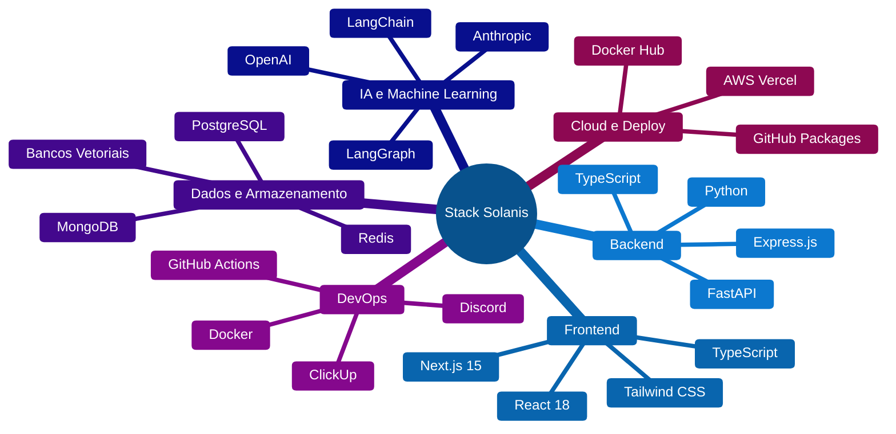
```mermaid
%%{init: {'theme':'base', 'themeVariables': {'primaryColor':'#2196F3','primaryTextColor':'#ffffff','primaryBorderColor':'#1976D2','lineColor':'#0D47A1','secondaryColor':'#42A5F5','tertiaryColor':'#64B5F6','background':'#ffffff','mainBkg':'#2196F3','secondaryBkg':'#1E88E5','tertiaryBkg':'#1976D2'}}}%%
mindmap
  root((Stack Solanis))
    Frontend
      Next.js 15
      React 18
      TypeScript
      Tailwind CSS
    Backend
      FastAPI
      Express.js
      TypeScript
      Python
    IA e Machine Learning
      LangChain
      LangGraph
      OpenAI
      Anthropic
    Dados e Armazenamento
      PostgreSQL
      MongoDB
      Redis
      Bancos Vetoriais
    DevOps
      Docker
      GitHub Actions
      ClickUp
      Discord
    Cloud e Deploy
      AWS Vercel
      Docker Hub
      GitHub Packages
```

---

## As Fases Solares da Metodologia

A Metodologia Solar é baseada na metáfora do ciclo diário do sol, onde cada fase representa um momento específico do desenvolvimento de soluções de IA, simbolizando a evolução natural de uma ideia até sua implementação completa.

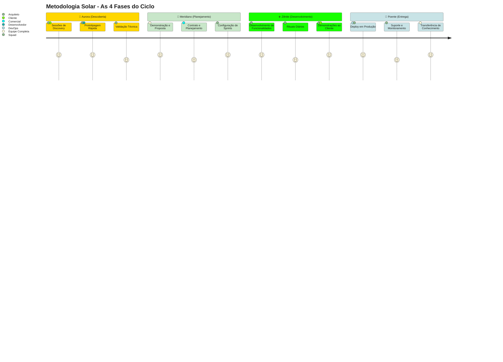
```mermaid
%%{init: {'theme':'base', 'themeVariables': {'primaryColor':'#FFD700','primaryTextColor':'#1a1a1a','primaryBorderColor':'#E1BEE7','lineColor':'#4A90E2','secondaryColor':'#C8E6C9','tertiaryColor':'#E3F2FD','background':'#ffffff'}}}%%
journey
    title Metodologia Solar - As 4 Fases do Ciclo
    section 🌅 Aurora (Descoberta)
      Sessões de Discovery: 5: Arquiteto, Cliente
      Prototipagem Rápida: 5: Arquiteto, Desenvolvedor
      Validação Técnica: 4: Arquiteto
    section 🌇 Meridiano (Planejamento)
      Demonstração e Proposta: 5: Equipe Completa
      Contrato e Planejamento: 4: Comercial
      Configuração de Sprints: 5: Arquiteto
    section ☀️ Zênite (Desenvolvimento)
      Desenvolvimento de Funcionalidades: 5: Squad
      Rituais Diários: 4: Squad
      Demonstrações ao Cliente: 5: Squad, Cliente
    section 🌅 Poente (Entrega)
      Deploy em Produção: 5: DevOps, Squad
      Suporte e Monitoramento: 4: Squad
      Transferência de Conhecimento: 5: Equipe Completa
```

### 🌅 **Aurora** - O Despertar da Solução
*"O momento em que a ideia ganha forma e clareza"*

A Aurora representa o início do projeto, quando as primeiras luzes da solução começam a aparecer. É a fase de descoberta intensa, onde transformamos problemas complexos em oportunidades claras através de prototipagem rápida e validação técnica.

### 🌇 **Meridiano** - A Consolidação da Visão  
*"Quando a solução atinge sua máxima clareza e definição"*

No Meridiano, a solução está completamente definida e validada. É o momento de apresentar o protótipo funcional, consolidar a proposta comercial e estabelecer o plano de execução detalhado.

### ☀️ **Zênite** - O Auge da Criação
*"O período de máxima energia e produtividade"*

O Zênite é a fase de desenvolvimento intensivo, onde toda a energia da equipe está focada na construção da solução. É quando as funcionalidades de IA ganham vida através de sprints bem estruturados e entregas contínuas.

### 🌅 **Poente** - A Culminação e Continuidade
*"O momento de colher os frutos e garantir a sustentabilidade"*

O Poente marca a transição da criação para a operação. É quando a solução é entregue ao cliente, estabilizada em produção e preparada para gerar valor contínuo ao negócio.

---

## Visão Geral da Metodologia

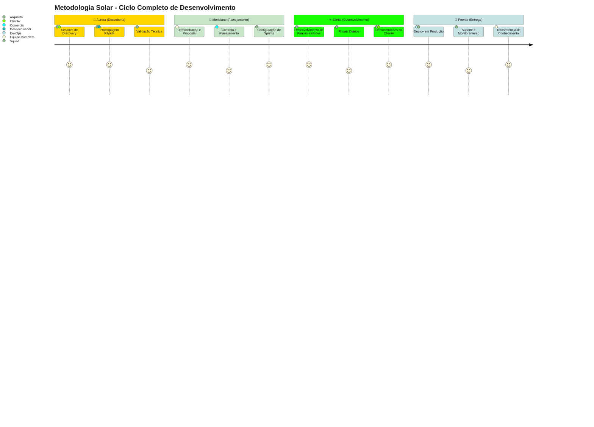
```mermaid
%%{init: {'theme':'base', 'themeVariables': {'primaryColor':'#FFD700','primaryTextColor':'#1a1a1a','primaryBorderColor':'#E1BEE7','lineColor':'#4A90E2','secondaryColor':'#C8E6C9','tertiaryColor':'#E3F2FD','background':'#ffffff'}}}%%
journey
    title Metodologia Solar - Ciclo Completo de Desenvolvimento
    section 🌅 Aurora (Descoberta)
      Sessões de Discovery: 5: Arquiteto, Cliente
      Prototipagem Rápida: 5: Arquiteto, Desenvolvedor
      Validação Técnica: 4: Arquiteto
    section 🌇 Meridiano (Planejamento)
      Demonstração e Proposta: 5: Equipe Completa
      Contrato e Planejamento: 4: Comercial
      Configuração de Sprints: 5: Arquiteto
    section ☀️ Zênite (Desenvolvimento)
      Desenvolvimento de Funcionalidades: 5: Squad
      Rituais Diários: 4: Squad
      Demonstrações ao Cliente: 5: Squad, Cliente
    section 🌅 Poente (Entrega)
      Deploy em Produção: 5: DevOps, Squad
      Suporte e Monitoramento: 4: Squad
      Transferência de Conhecimento: 5: Equipe Completa
```

---

## Estrutura Organizacional

### Arquiteto de Soluções IA
*Responsável pela visão técnica e arquitetural*

- Criar arquiteturas escaláveis utilizando LangChain e LangGraph
- Liderar descoberta técnica e prototipagem rápida
- Definir padrões de desenvolvimento e workflows de IA
- Revisar propostas técnicas e estimativas de esforço

### Squad de Desenvolvimento Full-Stack
*Equipe responsável pela implementação*

- Implementar soluções seguindo arquitetura definida
- Executar revisões de código e programação em pares
- Manter documentação atualizada no GitHub
- Realizar testes automatizados e validações

---

## Fase 1: 🌅 Aurora - Descoberta e Prototipagem
### Duração: 3-5 dias úteis

*"O momento em que a ideia ganha forma e clareza através da descoberta intensa e prototipagem rápida"*

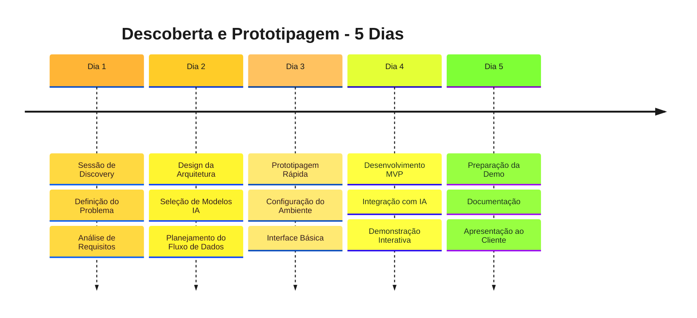
```mermaid
%%{init: {'theme':'base', 'themeVariables': {'primaryColor':'#FFE4B5','primaryTextColor':'#1a1a1a','primaryBorderColor':'#FFD700','lineColor':'#FF6B35','secondaryColor':'#FFEAA7','tertiaryColor':'#FFF3E0'}}}%%
timeline
    title Descoberta e Prototipagem - 5 Dias
    
    Dia 1 : Sessão de Discovery
          : Definição do Problema
          : Análise de Requisitos
    
    Dia 2 : Design da Arquitetura
          : Seleção de Modelos IA
          : Planejamento do Fluxo de Dados
    
    Dia 3 : Prototipagem Rápida
          : Configuração do Ambiente
          : Interface Básica
    
    Dia 4 : Desenvolvimento MVP
          : Integração com IA
          : Demonstração Interativa
    
    Dia 5 : Preparação da Demo
          : Documentação
          : Apresentação ao Cliente
```

### 1.1 Sessão de Discovery Intensiva

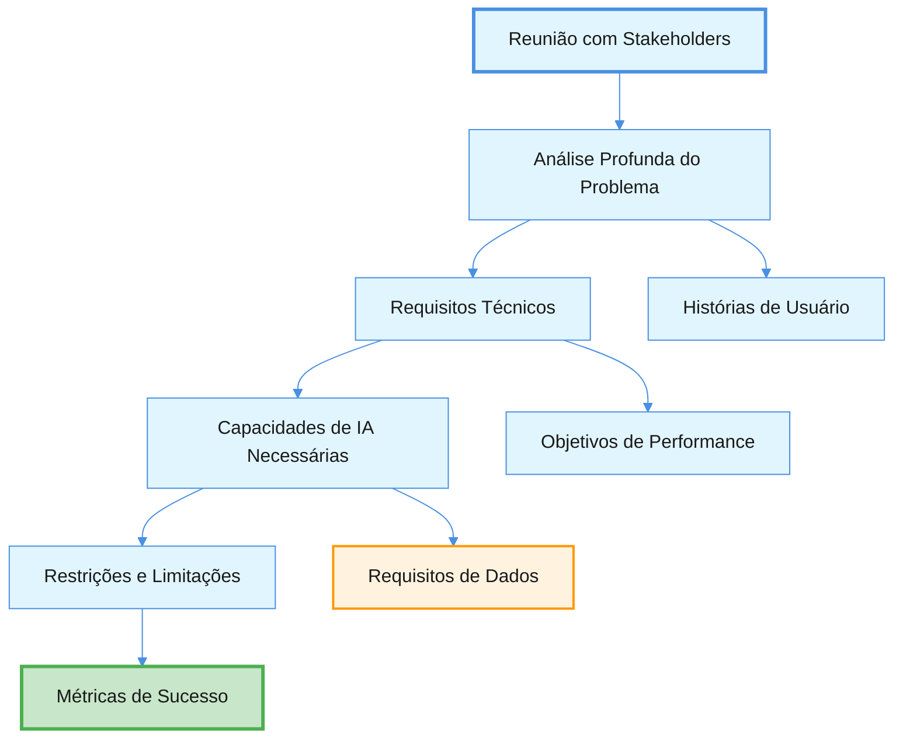
```mermaid
%%{init: {'theme':'base', 'themeVariables': {'primaryColor':'#E1F5FE','primaryTextColor':'#1a1a1a','primaryBorderColor':'#4A90E2','lineColor':'#4A90E2','secondaryColor':'#B3E5FC','tertiaryColor':'#E3F2FD'}}}%%
flowchart TD
    A[Reunião com Stakeholders] --> B[Análise Profunda do Problema]
    B --> C[Requisitos Técnicos]
    C --> D[Capacidades de IA Necessárias]
    D --> E[Restrições e Limitações]
    E --> F[Métricas de Sucesso]
    
    B --> G[Histórias de Usuário]
    C --> H[Objetivos de Performance]
    D --> I[Requisitos de Dados]
    
    style A fill:#E1F5FE,stroke:#4A90E2,stroke-width:3px
    style F fill:#C8E6C9,stroke:#4CAF50,stroke-width:3px
    style I fill:#FFF3E0,stroke:#FF9800,stroke-width:2px
```

**Participantes**: Arquiteto + Líder de Desenvolvimento + Stakeholders  
**Duração**: 3-4 horas  
**Entregáveis**:
- Definição clara do problema
- Requisitos funcionais e não-funcionais
- Restrições técnicas e de negócio
- Critérios de sucesso mensuráveis

### 1.2 Análise Técnica

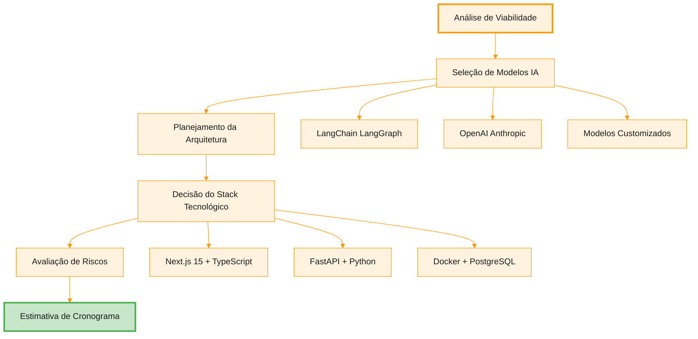
```mermaid
%%{init: {'theme':'base', 'themeVariables': {'primaryColor':'#FFF3E0','primaryTextColor':'#1a1a1a','primaryBorderColor':'#FF9800','lineColor':'#FF9800','secondaryColor':'#FFCC02','tertiaryColor':'#FFE082'}}}%%
graph TD
    A[Análise de Viabilidade] --> B[Seleção de Modelos IA]
    B --> C[Planejamento da Arquitetura]
    C --> D[Decisão do Stack Tecnológico]
    D --> E[Avaliação de Riscos]
    E --> F[Estimativa de Cronograma]
    
    B --> B1[LangChain LangGraph]
    B --> B2[OpenAI Anthropic]
    B --> B3[Modelos Customizados]
    
    D --> D1[Next.js 15 + TypeScript]
    D --> D2[FastAPI + Python]
    D --> D3[Docker + PostgreSQL]
    
    style A fill:#FFF3E0,stroke:#FF9800,stroke-width:3px
    style F fill:#C8E6C9,stroke:#4CAF50,stroke-width:3px
```

### 1.3 Prototipagem Rápida

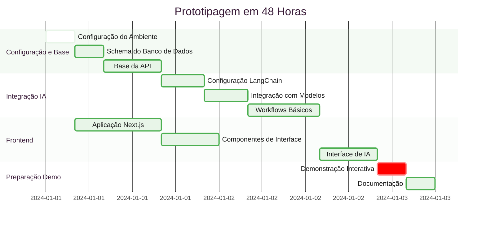
```mermaid
%%{init: {'theme':'base', 'themeVariables': {'primaryColor':'#E8F5E8','primaryTextColor':'#1a1a1a','primaryBorderColor':'#4CAF50','lineColor':'#4CAF50','secondaryColor':'#A5D6A7','tertiaryColor':'#C8E6C9'}}}%%
gantt
    title Prototipagem em 48 Horas
    dateFormat  YYYY-MM-DD
    section Configuração e Base
    Configuração do Ambiente    :active, setup, 2024-01-01, 4h
    Schema do Banco de Dados      :db, after setup, 4h
    Base da API       :api, after db, 8h
    section Integração IA
    Configuração LangChain      :lc, after api, 6h
    Integração com Modelos    :model, after lc, 6h
    Workflows Básicos      :flow, after model, 10h
    section Frontend
    Aplicação Next.js          :next, after setup, 12h
    Componentes de Interface        :ui, after next, 8h
    Interface de IA         :ai-ui, after flow, 8h
    section Preparação Demo
    Demonstração Interativa     :crit, demo, after ai-ui, 4h
    Documentação        :docs, after demo, 4h
```

**Entregáveis**:
- MVP funcional (prova de conceito)
- Diagramas de arquitetura
- Fluxogramas de processo de IA
- Demonstração interativa

---

## Fase 2: 🌇 Meridiano - Planejamento e Proposta
### Duração: 2-3 dias úteis

*"Quando a solução atinge sua máxima clareza através da demonstração e consolidação da proposta"*

### 2.1 Apresentação do Protótipo

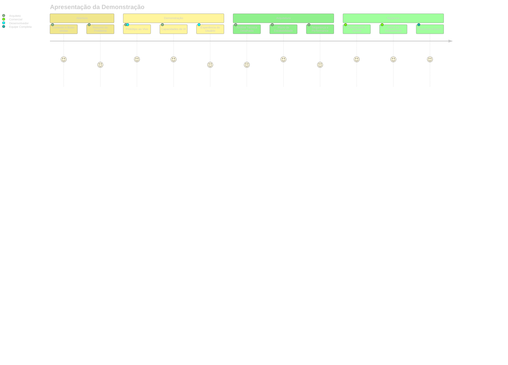
```mermaid
%%{init: {'theme':'dark', 'themeVariables': {'primaryColor':'#F0E68C','primaryTextColor':'#ffffff','primaryBorderColor':'#FFD700','lineColor':'#FFA000','secondaryColor':'#FFF59D','tertiaryColor':'#FFECB3'}}}%%
journey
    title Apresentação da Demonstração
    section Abertura
      Contexto e Boas-vindas: 5: Arquiteto
      Resumo do Problema: 4: Arquiteto
    section Demonstração
      Protótipo ao Vivo: 5: Arquiteto, Desenvolvedor
      Capacidades de IA: 5: Arquiteto
      Experiência do Usuário: 4: Desenvolvedor
    section Arquitetura
      Análise Técnica Detalhada: 4: Arquiteto
      Plano de Escalabilidade: 5: Arquiteto
      Segurança e Performance: 4: Arquiteto
    section Negócios
      Cronograma e Sprints: 5: Comercial
      Plano de Investimento: 5: Comercial
      Próximos Passos: 5: Equipe Completa
```

### 2.2 Proposta Comercial

- **Escopo Detalhado** com épicos e histórias de usuário
- **Cronograma de Sprints** com marcos claros
- **Modelo de Investimento** transparente
- **Termos e Condições** objetivos
- **Métricas de Sucesso** mensuráveis

---

## Fase 3: ☀️ Zênite - Desenvolvimento
### Duração: Variável por projeto

*"O período de máxima energia e produtividade, onde as funcionalidades de IA ganham vida"*

### Estrutura de Sprint

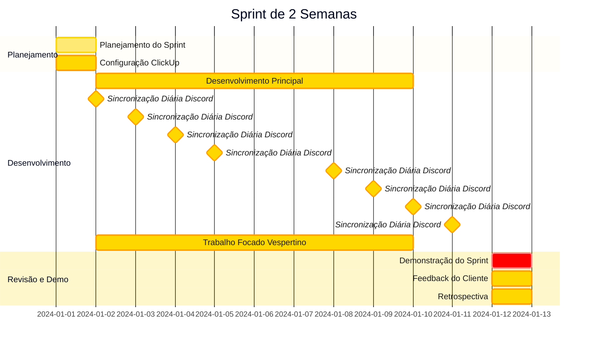
```mermaid
%%{init: {'theme':'base', 'themeVariables': {'primaryColor':'#FFD700','primaryTextColor':'#1a1a1a','primaryBorderColor':'#FFA000','lineColor':'#FF6F00','secondaryColor':'#FFECB3','tertiaryColor':'#FFF8E1'}}}%%
gantt
    title Sprint de 2 Semanas
    dateFormat  YYYY-MM-DD
    section Planejamento
    Planejamento do Sprint      :active, planning, 2024-01-01, 1d
    Configuração ClickUp        :clickup, 2024-01-01, 1d
    section Desenvolvimento
    Desenvolvimento Principal     :dev, 2024-01-02, 8d
    Sincronização Diária Discord   :milestone, sync1, 2024-01-02, 0d
    Sincronização Diária Discord   :milestone, sync2, 2024-01-03, 0d
    Sincronização Diária Discord   :milestone, sync3, 2024-01-04, 0d
    Sincronização Diária Discord   :milestone, sync4, 2024-01-05, 0d
    Sincronização Diária Discord   :milestone, sync5, 2024-01-08, 0d
    Sincronização Diária Discord   :milestone, sync6, 2024-01-09, 0d
    Sincronização Diária Discord   :milestone, sync7, 2024-01-10, 0d
    Sincronização Diária Discord   :milestone, sync8, 2024-01-11, 0d
    Trabalho Focado Vespertino  :deepwork, 2024-01-02, 8d
    section Revisão e Demo
    Demonstração do Sprint          :crit, demo, 2024-01-12, 1d
    Feedback do Cliente      :feedback, 2024-01-12, 1d
    Retrospectiva        :retro, 2024-01-12, 1d
```

### Entregas por Marco

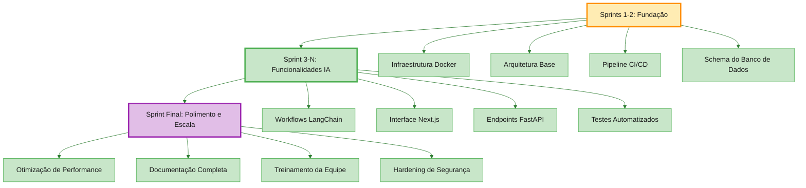
```mermaid
%%{init: {'theme':'base', 'themeVariables': {'primaryColor':'#C8E6C9','primaryTextColor':'#1a1a1a','primaryBorderColor':'#4CAF50','lineColor':'#2E7D32','secondaryColor':'#A5D6A7','tertiaryColor':'#E8F5E8'}}}%%
graph TD
    S1[Sprints 1-2: Fundação] --> S2[Sprint 3-N: Funcionalidades IA]
    S2 --> S3[Sprint Final: Polimento e Escala]
    
    S1 --> F1[Infraestrutura Docker]
    S1 --> F2[Arquitetura Base]
    S1 --> F3[Pipeline CI/CD]
    S1 --> F4[Schema do Banco de Dados]
    
    S2 --> C1[Workflows LangChain]
    S2 --> C2[Interface Next.js]
    S2 --> C3[Endpoints FastAPI]
    S2 --> C4[Testes Automatizados]
    
    S3 --> P1[Otimização de Performance]
    S3 --> P2[Documentação Completa]
    S3 --> P3[Treinamento da Equipe]
    S3 --> P4[Hardening de Segurança]
    
    style S1 fill:#FFECB3,stroke:#FF8F00,stroke-width:3px
    style S2 fill:#C8E6C9,stroke:#4CAF50,stroke-width:3px
    style S3 fill:#E1BEE7,stroke:#9C27B0,stroke-width:3px
```

---

## Fase 4: 🌅 Poente - Entrega e Suporte
### Duração: 3-4 semanas

*"O momento de colher os frutos e garantir a sustentabilidade da solução em produção"*

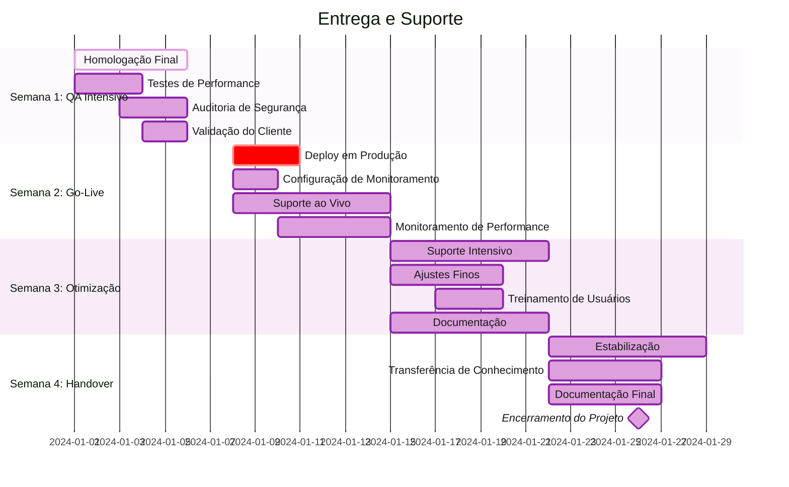
```mermaid
%%{init: {'theme':'base', 'themeVariables': {'primaryColor':'#DDA0DD','primaryTextColor':'#1a1a1a','primaryBorderColor':'#8E24AA','lineColor':'#6A1B9A','secondaryColor':'#E1BEE7','tertiaryColor':'#F3E5F5'}}}%%
gantt
    title Entrega e Suporte
    dateFormat  YYYY-MM-DD
    section Semana 1: QA Intensivo
    Homologação Final   :active, w1, 2024-01-01, 5d
    Testes de Performance  :w1p, 2024-01-01, 3d
    Auditoria de Segurança       :w1s, 2024-01-03, 3d
    Validação do Cliente    :w1c, 2024-01-04, 2d
    section Semana 2: Go-Live
    Deploy em Produção    :crit, w2, 2024-01-08, 3d
    Configuração de Monitoramento     :w2m, 2024-01-08, 2d
    Suporte ao Vivo         :w2s, 2024-01-08, 7d
    Monitoramento de Performance  :w2p, 2024-01-10, 5d
    section Semana 3: Otimização
    Suporte Intensivo    :w3, 2024-01-15, 7d
    Ajustes Finos          :w3t, 2024-01-15, 5d
    Treinamento de Usuários        :w3u, 2024-01-17, 3d
    Documentação        :w3d, 2024-01-15, 7d
    section Semana 4: Handover
    Estabilização        :w4, 2024-01-22, 7d
    Transferência de Conhecimento   :w4k, 2024-01-22, 5d
    Documentação Final  :w4d, 2024-01-22, 5d
    Encerramento do Projeto      :milestone, closure, 2024-01-26, 0d
```

---

## Rituais Diários

### Sincronização Discord (09:00)

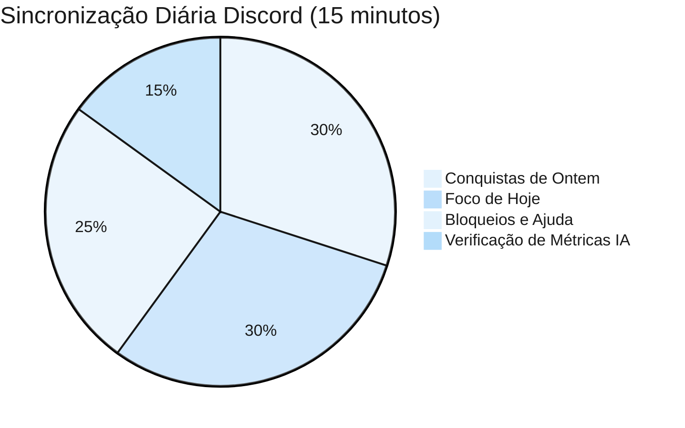
```mermaid
%%{init: {'theme':'base', 'themeVariables': {'primaryColor':'#E3F2FD','primaryTextColor':'#1a1a1a','primaryBorderColor':'#2196F3','lineColor':'#1976D2','secondaryColor':'#BBDEFB','tertiaryColor':'#E3F2FD'}}}%%
pie title Sincronização Diária Discord (15 minutos)
    "Conquistas de Ontem" : 30
    "Foco de Hoje" : 30
    "Bloqueios e Ajuda" : 25
    "Verificação de Métricas IA" : 15
```

### Sessão de Trabalho Focado (14:00)

- **Resolução de Problemas Complexos** (45 min)
- **Intervalo Rápido** (15 min)
- **Programação em Pares** (45 min)
- **Documentação e Revisão** (15 min)

---

## Padrões de Arquitetura

### Template de Arquitetura IA

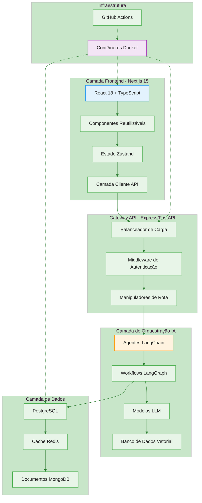
```mermaid
%%{init: {'theme':'base', 'themeVariables': {'primaryColor':'#E8F5E8','primaryTextColor':'#1a1a1a','primaryBorderColor':'#4CAF50','lineColor':'#2E7D32','secondaryColor':'#A5D6A7','tertiaryColor':'#C8E6C9'}}}%%
graph TB
    subgraph "Camada Frontend - Next.js 15"
        UI[React 18 + TypeScript] --> COMP[Componentes Reutilizáveis]
        COMP --> STATE[Estado Zustand]
        STATE --> API_CLIENT[Camada Cliente API]
    end
    
    subgraph "Gateway API - Express/FastAPI"
        API_CLIENT --> GATEWAY[Balanceador de Carga]
        GATEWAY --> AUTH[Middleware de Autenticação]
        AUTH --> ROUTES[Manipuladores de Rota]
    end
    
    subgraph "Camada de Orquestração IA"
        ROUTES --> LANGCHAIN[Agentes LangChain]
        LANGCHAIN --> LANGGRAPH[Workflows LangGraph]
        LANGGRAPH --> MODELS[Modelos LLM]
        MODELS --> VECTOR[Banco de Dados Vetorial]
    end
    
    subgraph "Camada de Dados"
        LANGGRAPH --> POSTGRES[PostgreSQL]
        POSTGRES --> REDIS[Cache Redis]
        REDIS --> MONGO[Documentos MongoDB]
    end
    
    subgraph "Infraestrutura"
        DOCKER[Contêineres Docker] -.-> UI
        DOCKER -.-> GATEWAY
        DOCKER -.-> POSTGRES
        GITHUB[GitHub Actions] -.-> DOCKER
    end
    
    style UI fill:#E3F2FD,stroke:#2196F3,stroke-width:2px
    style LANGCHAIN fill:#FFF3E0,stroke:#FF9800,stroke-width:2px
    style POSTGRES fill:#E8F5E8,stroke:#4CAF50,stroke-width:2px
    style DOCKER fill:#F3E5F5,stroke:#9C27B0,stroke-width:2px
```

---

## Pipeline CI/CD

```mermaid
%%{init: {'theme':'base', 'themeVariables': {'primaryColor':'#E1BEE7','primaryTextColor':'#1a1a1a','primaryBorderColor':'#9C27B0','lineColor':'#7B1FA2','secondaryColor':'#CE93D8','tertiaryColor':'#F3E5F5'}}}%%
graph LR
    A[Push do Código] --> B[GitHub Actions]
    B --> C[Testes Automatizados]
    C --> D[Build Docker]
    D --> E[Empacotamento e Push]
    E --> F[Deploy Staging]
    F --> G[Testes E2E]
    G --> H[Revisão Manual]
    H --> I[Deploy Produção]
    I --> J[Monitoramento Ativo]
    
    C -.->|Falha nos Testes| K[Parada do Pipeline]
    G -.->|Falha E2E| K
    J -.->|Problemas| L[Alerta Discord]
    
    style A fill:#E3F2FD,stroke:#2196F3,stroke-width:3px
    style I fill:#C8E6C9,stroke:#4CAF50,stroke-width:3px
    style K fill:#FFEBEE,stroke:#F44336,stroke-width:3px
    style L fill:#FFF3E0,stroke:#FF9800,stroke-width:3px
```

---

## Dashboard de Métricas

```mermaid
%%{init: {'theme':'base', 'themeVariables': {'primaryColor':'#E8F5E8','primaryTextColor':'#1a1a1a','primaryBorderColor':'#4CAF50','lineColor':'#2E7D32','secondaryColor':'#A5D6A7','tertiaryColor':'#C8E6C9'}}}%%
graph TD
    DASH[Centro de Comando Solanis] --> PROJECT[Métricas do Projeto]
    DASH --> AI[Performance IA]
    DASH --> TECH[Saúde Técnica]
    DASH --> BUSINESS[KPIs de Negócio]
    
    PROJECT --> P1[Velocidade do Sprint]
    PROJECT --> P2[Lead Time]
    PROJECT --> P3[Frequência de Deploy]
    PROJECT --> P4[Story Points Completados]
    
    AI --> A1[Precisão do Modelo]
    AI --> A2[Velocidade de Inferência]
    AI --> A3[Uso de Tokens]
    AI --> A4[Taxa de Sucesso LangChain]
    
    TECH --> T1[Cobertura de Testes]
    TECH --> T2[Tempo de Resolução de Bugs]
    TECH --> T3[Tempo de Resposta da API]
    TECH --> T4[Saúde dos Contêineres]
    
    BUSINESS --> B1[Satisfação do Cliente]
    BUSINESS --> B2[ROI do Projeto]
    BUSINESS --> B3[Time to Value]
    BUSINESS --> B4[Adoção de Funcionalidades]
    
    style DASH fill:#E1BEE7,stroke:#9C27B0,stroke-width:4px
    style PROJECT fill:#C8E6C9,stroke:#4CAF50,stroke-width:3px
    style AI fill:#FFE4B5,stroke:#FF9800,stroke-width:3px
    style TECH fill:#E3F2FD,stroke:#2196F3,stroke-width:3px
    style BUSINESS fill:#FFF3E0,stroke:#FF9800,stroke-width:3px
```

---

## Definition of Done

### Critérios para Feature

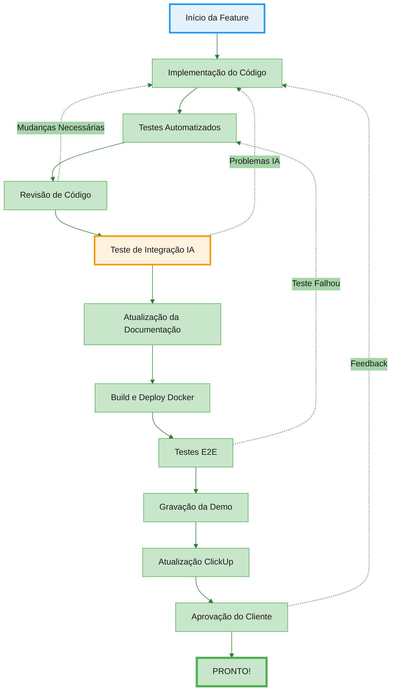
```mermaid
%%{init: {'theme':'base', 'themeVariables': {'primaryColor':'#C8E6C9','primaryTextColor':'#1a1a1a','primaryBorderColor':'#4CAF50','lineColor':'#2E7D32','secondaryColor':'#A5D6A7','tertiaryColor':'#E8F5E8'}}}%%
flowchart TD
    START[Início da Feature] --> CODE[Implementação do Código]
    CODE --> TESTS[Testes Automatizados]
    TESTS --> REVIEW[Revisão de Código]
    REVIEW --> AI_TEST[Teste de Integração IA]
    AI_TEST --> DOCS[Atualização da Documentação]
    DOCS --> DEPLOY[Build e Deploy Docker]
    DEPLOY --> E2E[Testes E2E]
    E2E --> DEMO[Gravação da Demo]
    DEMO --> CLICKUP[Atualização ClickUp]
    CLICKUP --> CLIENT[Aprovação do Cliente]
    CLIENT --> DONE[PRONTO!]
    
    REVIEW -.->|Mudanças Necessárias| CODE
    AI_TEST -.->|Problemas IA| CODE
    E2E -.->|Teste Falhou| TESTS
    CLIENT -.->|Feedback| CODE
    
    style START fill:#E3F2FD,stroke:#2196F3,stroke-width:3px
    style DONE fill:#C8E6C9,stroke:#4CAF50,stroke-width:4px
    style AI_TEST fill:#FFF3E0,stroke:#FF9800,stroke-width:3px
```

### Checklist do Sprint

**Critérios Obrigatórios:**
- ✅ **Todas as features planejadas** entregues e funcionais
- ✅ **Cobertura de testes** >= 80% para código novo
- ✅ **Modelos IA** validados com métricas de precisão
- ✅ **Benchmarks de performance** atingidos (< 2s tempo de resposta)
- ✅ **Demo gravada** e compartilhada no Discord
- ✅ **ClickUp atualizado** com progresso real
- ✅ **Imagens Docker** construídas e enviadas para registry
- ✅ **Documentação técnica** atualizada no GitHub
- ✅ **Feedback do cliente** coletado e incorporado
- ✅ **Retrospectiva** realizada com itens de ação

---

## Métricas DORA - Framework de Performance DevOps

### O que são as Métricas DORA?

As métricas DORA (DevOps Research and Assessment) são um conjunto de indicadores desenvolvidos pelo Google para medir a performance de equipes de desenvolvimento de software. Estas métricas foram identificadas através de pesquisas extensivas como os principais fatores que diferenciam equipes de alto desempenho.

### As 4 Métricas Fundamentais

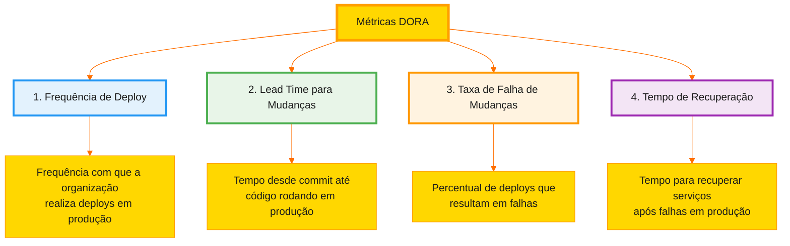
```mermaid
%%{init: {'theme':'base', 'themeVariables': {'primaryColor':'#FFD700','primaryTextColor':'#1a1a1a','primaryBorderColor':'#FFA000','lineColor':'#FF6F00','secondaryColor':'#E1BEE7','tertiaryColor':'#C8E6C9'}}}%%
graph TD
    DORA[Métricas DORA] --> DF[1. Frequência de Deploy]
    DORA --> LT[2. Lead Time para Mudanças]
    DORA --> CFR[3. Taxa de Falha de Mudanças]
    DORA --> RT[4. Tempo de Recuperação]
    
    DF --> DF_DESC[Frequência com que a organização<br/>realiza deploys em produção]
    LT --> LT_DESC[Tempo desde commit até<br/>código rodando em produção]
    CFR --> CFR_DESC[Percentual de deploys que<br/>resultam em falhas]
    RT --> RT_DESC[Tempo para recuperar serviços<br/>após falhas em produção]
    
    style DORA fill:#FFD700,stroke:#FFA000,stroke-width:4px
    style DF fill:#E3F2FD,stroke:#2196F3,stroke-width:3px
    style LT fill:#E8F5E8,stroke:#4CAF50,stroke-width:3px
    style CFR fill:#FFF3E0,stroke:#FF9800,stroke-width:3px
    style RT fill:#F3E5F5,stroke:#9C27B0,stroke-width:3px
```

### Classificação de Performance

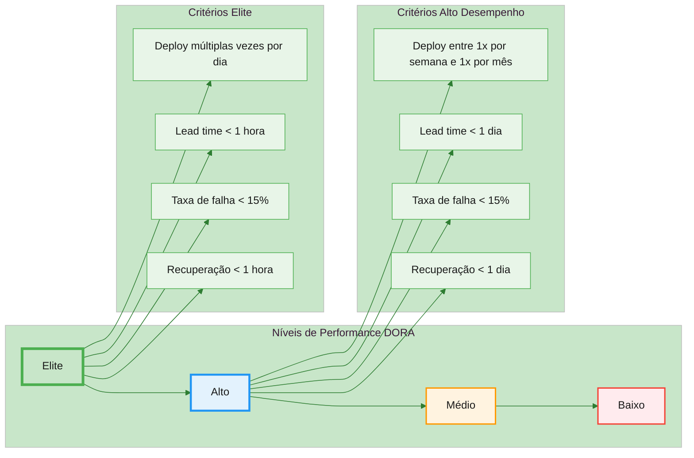
```mermaid
%%{init: {'theme':'base', 'themeVariables': {'primaryColor':'#E8F5E8','primaryTextColor':'#1a1a1a','primaryBorderColor':'#4CAF50','lineColor':'#2E7D32','secondaryColor':'#A5D6A7','tertiaryColor':'#C8E6C9'}}}%%
graph LR
    subgraph "Níveis de Performance DORA"
        ELITE[Elite] --> HIGH[Alto]
        HIGH --> MEDIUM[Médio]
        MEDIUM --> LOW[Baixo]
    end
    
    subgraph "Critérios Elite"
        E1[Deploy múltiplas vezes por dia]
        E2[Lead time < 1 hora]
        E3[Taxa de falha < 15%]
        E4[Recuperação < 1 hora]
    end
    
    subgraph "Critérios Alto Desempenho"
        H1[Deploy entre 1x por semana e 1x por mês]
        H2[Lead time < 1 dia]
        H3[Taxa de falha < 15%]
        H4[Recuperação < 1 dia]
    end
    
    ELITE --> E1
    ELITE --> E2
    ELITE --> E3
    ELITE --> E4
    
    HIGH --> H1
    HIGH --> H2
    HIGH --> H3
    HIGH --> H4
    
    style ELITE fill:#C8E6C9,stroke:#4CAF50,stroke-width:4px
    style HIGH fill:#E3F2FD,stroke:#2196F3,stroke-width:3px
    style MEDIUM fill:#FFF3E0,stroke:#FF9800,stroke-width:2px
    style LOW fill:#FFEBEE,stroke:#F44336,stroke-width:2px
```

### Implementação na Metodologia Solar

#### 1. Frequência de Deploy

**O que medimos:**
- Número de releases para produção por período
- Automação do pipeline de deploy
- Capacidade de deploy sob demanda

**Como melhoramos:**
- Pipeline CI/CD totalmente automatizado
- Deploys automatizados via GitHub Actions
- Feature flags para releases controladas
- Ambiente de staging idêntico à produção

#### 2. Lead Time para Mudanças

**O que medimos:**
- Tempo desde commit até produção
- Tempo de revisão de código
- Tempo de execução dos testes
- Tempo de deploy e verificação

**Como otimizamos:**
- Testes automatizados rápidos (< 10 min)
- Revisões de código ágeis (< 4 horas)
- Deploy automatizado (< 15 min)
- Monitoramento de performance contínuo

#### 3. Taxa de Falha de Mudanças

**O que medimos:**
- Percentual de deploys que geram incidentes
- Rollbacks necessários
- Hotfixes em produção
- Indisponibilidade de serviços

**Como reduzimos:**
- Cobertura de testes > 80%
- Testes de integração abrangentes
- Ambiente de staging para validação
- Monitoramento proativo

#### 4. Tempo de Recuperação

**O que medimos:**
- Tempo para detectar problemas
- Tempo para diagnosticar causa raiz
- Tempo para implementar correção
- Tempo para restaurar serviço

**Como aceleramos:**
- Monitoramento em tempo real
- Alertas automatizados no Discord
- Playbooks de incident response
- Rollback automatizado

### Métricas Atuais da Solanis

```mermaid
%%{init: {'theme':'base', 'themeVariables': {'primaryColor':'#FFD700','primaryTextColor':'#1a1a1a','primaryBorderColor':'#FFA000','lineColor':'#FF6F00','secondaryColor':'#E1BEE7','tertiaryColor':'#C8E6C9'}}}%%
graph TD
    PERFORMANCE[Performance Atual Solanis] --> DF_CURRENT[Frequência de Deploy]
    PERFORMANCE --> LT_CURRENT[Lead Time]
    PERFORMANCE --> CFR_CURRENT[Taxa de Falha]
    PERFORMANCE --> RT_CURRENT[Tempo de Recuperação]
    
    DF_CURRENT --> DF1[Meta: Deploys Diários]
    DF_CURRENT --> DF2[Atual: 2-3x por semana]
    DF_CURRENT --> DF3[Status: Alto Desempenho]
    DF_CURRENT --> DF4[Evolução: → Elite]
    
    LT_CURRENT --> LT1[Meta: < 1 dia]
    LT_CURRENT --> LT2[Atual: 2-3 dias]
    LT_CURRENT --> LT3[Status: Alto Desempenho]
    LT_CURRENT --> LT4[Evolução: → Elite]
    
    CFR_CURRENT --> CFR1[Meta: < 15%]
    CFR_CURRENT --> CFR2[Atual: 8-10%]
    CFR_CURRENT --> CFR3[Status: Elite]
    CFR_CURRENT --> CFR4[Mantém: Elite]
    
    RT_CURRENT --> RT1[Meta: < 1 hora]
    RT_CURRENT --> RT2[Atual: 30 min]
    RT_CURRENT --> RT3[Status: Elite]
    RT_CURRENT --> RT4[Mantém: Elite]
    
    style PERFORMANCE fill:#FFD700,stroke:#FFA000,stroke-width:4px
    style DF3 fill:#E3F2FD,stroke:#2196F3,stroke-width:3px
    style LT3 fill:#E3F2FD,stroke:#2196F3,stroke-width:3px
    style CFR3 fill:#C8E6C9,stroke:#4CAF50,stroke-width:3px
    style RT3 fill:#C8E6C9,stroke:#4CAF50,stroke-width:3px
    style DF4 fill:#C8E6C9,stroke:#4CAF50,stroke-width:2px
    style LT4 fill:#C8E6C9,stroke:#4CAF50,stroke-width:2px
```

### Benefícios das Métricas DORA

**Para o Negócio:**
- Maior velocidade de entrega de features
- Redução de riscos em releases
- Melhora na satisfação do cliente
- Vantagem competitiva no mercado

**Para a Equipe:**
- Feedback rápido sobre mudanças
- Menos stress com deploys
- Maior confiança no código
- Foco em melhorias contínuas

**Para a Operação:**
- Menor tempo de indisponibilidade
- Recuperação rápida de incidentes
- Processos mais previsíveis
- Redução de trabalho manual

### Ferramentas de Monitoramento

```mermaid
%%{init: {'theme':'base', 'themeVariables': {'primaryColor':'#E1BEE7','primaryTextColor':'#1a1a1a','primaryBorderColor':'#9C27B0','lineColor':'#7B1FA2','secondaryColor':'#CE93D8','tertiaryColor':'#F3E5F5'}}}%%
graph TD
    TOOLS[Ferramentas de Monitoramento DORA] --> GH[GitHub Actions]
    TOOLS --> CLICKUP[ClickUp Analytics]
    TOOLS --> DISCORD[Discord Alerts]
    TOOLS --> MONITORING[Monitoring Stack]
    
    GH --> GH1[Deploy frequency tracking]
    GH --> GH2[Lead time measurement]
    GH --> GH3[Build success rates]
    
    CLICKUP --> CU1[Sprint velocity]
    CLICKUP --> CU2[Task completion time]
    CLICKUP --> CU3[Cycle time analysis]
    
    DISCORD --> DIS1[Real-time alerts]
    DISCORD --> DIS2[Incident notifications]
    DISCORD --> DIS3[Recovery updates]
    
    MONITORING --> MON1[Application performance]
    MONITORING --> MON2[Error rate tracking]
    MONITORING --> MON3[Uptime monitoring]
    
    style TOOLS fill:#E1BEE7,stroke:#9C27B0,stroke-width:4px
    style GH fill:#E8F5E8,stroke:#4CAF50,stroke-width:3px
    style CLICKUP fill:#E3F2FD,stroke:#2196F3,stroke-width:3px
    style DISCORD fill:#FFF3E0,stroke:#FF9800,stroke-width:3px
    style MONITORING fill:#F3E5F5,stroke:#9C27B0,stroke-width:3px
```

### Plano de Evolução DORA

**Trimestre 1: Fundação**
- Implementar monitoramento básico das 4 métricas
- Estabelecer baseline de performance atual
- Automatizar coleta de dados

**Trimestre 2: Otimização**
- Reduzir lead time através de automação
- Aumentar frequência de deploys
- Melhorar cobertura de testes

**Trimestre 3: Elite Performance**
- Atingir classificação Elite em todas as métricas
- Implementar deploy contínuo
- Automatizar recuperação de incidentes

**Trimestre 4: Sustentação**
- Manter performance Elite
- Treinar equipes em práticas DORA
- Compartilhar conhecimento com outros projetos

---

## Integração ClickUp

```mermaid
%%{init: {'theme':'base', 'themeVariables': {'primaryColor':'#E1BEE7','primaryTextColor':'#1a1a1a','primaryBorderColor':'#9C27B0','lineColor':'#7B1FA2','secondaryColor':'#CE93D8','tertiaryColor':'#F3E5F5'}}}%%
journey
    title Fluxo de Trabalho ClickUp
    section Criação de Tarefas
      Planejamento de Épicos: 5: Product Owner
      Quebra de Histórias: 4: Arquiteto
      Atribuição de Tarefas: 5: Líder do Squad
    section Fluxo de Desenvolvimento
      Em Progresso: 4: Desenvolvedor
      Revisão de Código: 5: Equipe
      Testes: 4: QA
    section Entrega
      Revisão do Cliente: 5: Cliente
      Deploy: 5: DevOps
      Concluído: 5: Todos
```

---

## Resultados Esperados

### Diferenciais da Metodologia Solar

**Prototipagem Acelerada**
48 horas para MVP funcional com IA integrada e demonstração interativa

**Stack Tecnológico Moderno**
Next.js 15, FastAPI, LangChain, Docker em arquitetura escalável

**Integração Completa**
GitHub + ClickUp + Discord em workflows automatizados

**Métricas de Performance**
DORA metrics + rastreamento de performance de IA em tempo real

### Métricas de Sucesso

| **Métrica** | **Meta** | **Status** |
|:---|:---:|:---:|
| **Velocidade de Prototipagem** | +300% | Elite |
| **Precisão em Estimativas** | 95%+ | Alto |
| **Tempo de Resposta da API** | <2s | Elite |
| **Net Promoter Score** | 9+ | Elite |
| **Performance DORA** | Elite | Elite |

---

## Conclusão

A Metodologia Solar representa um framework consolidado para desenvolvimento de soluções empresariais com Inteligência Artificial, focando em:

- **Entrega de valor** através de prototipagem rápida e validação contínua
- **Qualidade técnica** com padrões de arquitetura e testes automatizados
- **Transparência** no processo com métricas e comunicação estruturada
- **Escalabilidade** das soluções através de tecnologias modernas

Este framework permite que organizações implementem soluções de IA de forma estruturada, minimizando riscos e maximizando o retorno sobre investimento.
